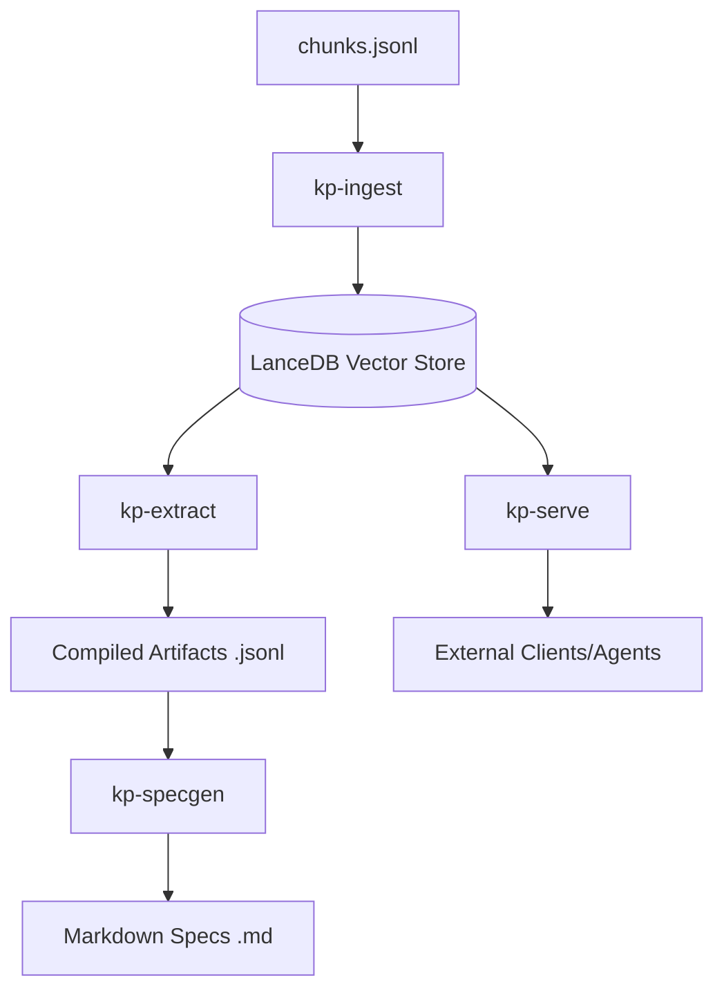

# Knowledge Platform

The Knowledge Platform is a specialized system designed to extract structured trading knowledge from video transcripts. It transforms raw video data into machine-usable artifacts like strategy specifications, signal definitions, and risk rules, providing a grounded foundation for automated trading system development.

## Core Features

- **Vectorized Ingestion**: Index video transcript chunks with embeddings for semantic search.
- **Structured Extraction**: Use LLMs to extract trading concepts, signals, strategies, and risk rules with evidence links.
- **Conflict Detection**: Automatically identify ambiguities and contradictions in source material.
- **Specification Generation**: Produce professional-grade Markdown documents (PRD, Signal Catalog, etc.) from extracted knowledge.
- **Retrieval API**: FastAPI-based server for semantic search and chunk access.

## Architecture

The platform follows a staged pipeline from raw data to engineering specifications:



## Installation

### Prerequisites

- Python 3.10+
- OpenAI API Key (for extraction)

### Setup

1. Clone the repository and navigate to the `knowledge_platform` directory.
2. Install the package in editable mode:

```bash
pip install -e .
```

3. Configure your environment:

```bash
export OPENAI_API_KEY="your-api-key"
```

## Configuration

The platform is configured via `config.yaml` in the root directory.

```yaml
data:
  raw_dir: "./data/raw"
  compiled_dir: "./data/compiled"
  specs_dir: "./data/specs"
  vector_db_path: "./data/vectordb"

embeddings:
  model: "all-MiniLM-L6-v2"
  dimension: 384

extraction:
  llm_provider: "openai"
  model: "gpt-4o-mini"
  temperature: 0
  max_retries: 3
  batch_size: 5

server:
  host: "127.0.0.1"
  port: 8000
```

## Quick Start

Transform a transcript file into a full trading system specification in four steps:

```bash
# 1. Ingest raw chunks
kp-ingest data/raw/chunks.jsonl

# 2. Extract all knowledge artifacts
kp-extract all --output-dir data/compiled/

# 3. Generate specification documents
kp-specgen --compiled-dir data/compiled/ --output-dir data/specs/

# 4. (Optional) Start the retrieval API
kp-serve
```

## CLI Reference

### `kp-ingest`
Ingests `chunks.jsonl` into the vector database.

```bash
kp-ingest path/to/chunks.jsonl [options]
```
- `--db <path>`: Override vector DB path.
- `--model <name>`: Use a different embedding model.
- `--force`: Re-embed all chunks (drops existing table).

### `kp-extract`
Runs LLM-powered extraction jobs.

```bash
kp-extract <command> [options]
```

**Commands:**
- `concepts`: Extract trading terms and definitions.
- `signals`: Extract measurable market conditions and logic.
- `strategies`: Extract operational strategy specifications.
- `rules`: Extract risk management rules.
- `conflicts`: Detect contradictions and generate open questions.
- `all`: Run all extraction jobs in sequence.

**Example:**
```bash
kp-extract strategies --names "Breakout" "Mean Reversion" --output data/compiled/strategies.jsonl
```

### `kp-specgen`
Generates Markdown documents from compiled artifacts.

```bash
kp-specgen [options]
```
- `--compiled-dir <path>`: Source directory for `.jsonl` artifacts.
- `--output-dir <path>`: Target directory for `.md` documents.

### `kp-serve`
Starts the FastAPI retrieval server.

```bash
kp-serve [--host <host>] [--port <port>] [--reload]
```

## API Reference

The server provides endpoints for semantic search and chunk retrieval.

- `GET /health`: Health check.
- `POST /search`: Semantic search for chunks.
  - Body: `{"query": "text", "top_k": 10, "video_id": "optional"}`
- `GET /chunks/{id}`: Retrieve a specific chunk by ID.
- `GET /chunks/{id}/context`: Retrieve a chunk with surrounding context.
- `GET /videos`: List all unique video IDs in the database.
- `GET /stats`: Get database statistics (chunk count, video count).

## Data Schema

Extracted artifacts are stored in `data/compiled/` as JSONL files with evidence links back to source chunks:

- `concepts.jsonl`: Terminology and definitions.
- `signals.jsonl`: Operational signal logic and inputs.
- `strategies.jsonl`: Entry/exit rules, parameters, and trade management.
- `risk_rules.jsonl`: Risk limits and safety filters.
- `open_questions.jsonl`: Ambiguities requiring human clarification.

## Troubleshooting

- **Database Not Found**: Ensure you have run `kp-ingest` before attempting extraction or search.
- **Extraction Failures**: Check your `OPENAI_API_KEY` environment variable and ensure you have sufficient quota.
- **Empty Search Results**: Verify that the ingestion process completed successfully and that the embedding model matches the one used during ingestion.
- **Noisy Extraction**: If extraction results are irrelevant, try reducing the `batch_size` in `config.yaml` or using more specific search terms with `--topics` or `--names`.
